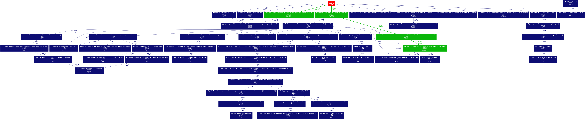

# AccPlusPlus
Accelerator for C++ STL
source code/output is collected by each profiler 
### TODO (11/19/2018)
For all: 
1. Run gprof on <a href="./benchmarks/Simple_push_back/push_back.cpp" target="_blank">```./benchmarks/Simple_push_back/push_back.cpp``` </a> and <a href="http://nghiaho.com/?p=1726" target="_blank">Pseudo Inverse Test by Nghia Ho's blog</a> from <a href="./benchmarks/test_matrix_pseudoinverse.cpp" target="_blank">```./benchmarks/test_matrix_pseudoinverse.cpp``` </a> **_./benchmarks/test_matrix_pseudoinverse.cpp_** on:

- [x] Simple_push_back
- [x] OpenCV
- [x] Eigen
- [x] Armadillo + OpenBLAS
- [x] Armadillo + Atlas (no multi-core supportout of the box???)
- [x] OpenCV
- [ ] Replace the content of <a href="./benchmarks/Wicht_STL_synthetic/Makefile" target="_blank">```benchmarks/Wicht_STL_synthetic/Makefile``` </a>.

To compile & generate flat-profiled benchmark data
Simple_push_back:
```
cd benchmarks/Simple_push_back
make 
``` 

Opencv:
```
cd benchmarks/opencv
make 
```

To install opencv, first clone to <__project_dir__> (parent dir of AccPlusPlus), then run ```./build_open_cv.sh`` bash: 
```bash
cd ../
git clone https://github.com/opencv/opencv.git. 
cd  AccPlusPlus
./build_open_cv.sh
```

Eigen:
```
cd benchmarks/eigen
make 
```

Armadillo + OpenBLAS (FrankieD4C: For arma and opencv benchmark, I removed -O3 flag when compile since gprof cannot work):
```
cd benchmarks/arma
make openblas
```

Armadillo + Atlas:
```
cd benchmarks/arma
make altas
```

OpenCV
```
cd benchmarks/opencv
make
```

Full tutorial <a href="https://docs.opencv.org/master/d7/d9f/tutorial_linux_install.html" target="_blank">Pseudo Inverse Test by Nghia Ho's blog</a>  

To generate  __function directed acyclic graph (DAG)__, run change gprof instruction in Makefile to pipe to  gprof. For example, as in Simple_push_back
```
gprof ./push_back.o gmon.out | tee push_back.prof  | gprof2dot  -n0 -e0| dot -Tpng -o func_dag.png 
```
sample output :


<!--  -->

To generate <a href="https://ftp.gnu.org/pub/old-gnu/Manuals/gprof-2.9.1/html_node/gprof_17.html" target="_blank"> __line by line profliling__</a>, add similar contents as for simple_push_back (we indeed use gcov instead):  
```
push_back_line_by_line.o: push_back.cpp
	g++ -std=c++11 -fprofile-arcs -ftest-coverage push_back.cpp
	gcov push_back.cpp
	mv *.gcov gcov_out
```

2. Plot the histogram of leaf function like Figure 3 by [Gope et al](http://pharm.ece.wisc.edu/papers/isca17_dgope.pdf) 


3. Find the "bottleneck" (performance, power, etc)

    - [ ] Granularity of the analysis: Memory address, Memory size, leaf function, "semantic operations" (what the program mainly does) 

4. Discuss with Prof. by this Friday (11/22)

    - [ ] Memory slab plot for memory allocation like Figure  8(a), similar to the idea of "heap manager" for PHP acceleration. 

    

    - [ ] "psudo-deep copy" upon value assignment (Lvalue vs Rvalue)
